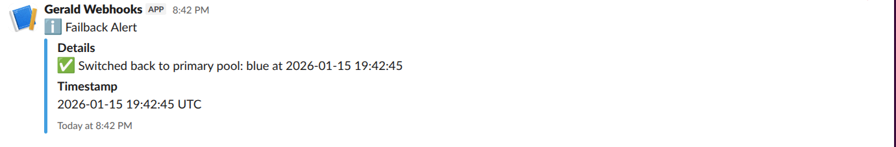
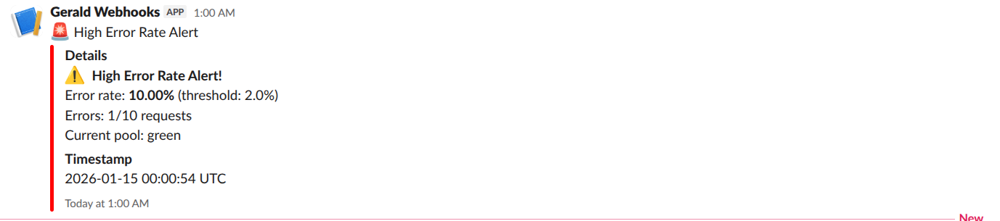

# 🚀 Zero-Downtime Blue/Green Deployment with Intelligent Monitoring

[](https://www.docker.com/)
[](https://nginx.org/)
[](https://www.python.org/)
[](https://slack.com/)

> **A production-ready blue/green deployment system with automatic failover, real-time monitoring, and Slack alerting—all orchestrated with Docker Compose.**

---

## 🎯 What This Project Does

Imagine deploying your application **without any downtime**. When something goes wrong, traffic automatically switches to a healthy backup—and your team gets instant alerts on Slack. That's what this system delivers.

### ✨ Key Features

- **🔄 Automatic Failover**: When the primary service fails, Nginx instantly routes traffic to the backup
- **⚡ Zero Client Errors**: Failed requests are transparently retried on healthy instances
- **👀 Real-Time Monitoring**: Python watcher continuously analyzes logs and tracks system health
- **📱 Slack Alerts**: Instant notifications for failovers and elevated error rates
- **🎚️ Dynamic Pool Switching**: Toggle between blue and green deployments with a single command
- **📊 Detailed Logging**: Structured logs capture every request with pool, release, timing, and status info
- **🛡️ Production-Ready**: Configurable thresholds, alert cooldowns, and error windows

---

## 📖 Table of Contents

- [Architecture](#-architecture)
- [Quick Start](#-quick-start)
- [How It Works](#-how-it-works)
- [Configuration](#%EF%B8%8F-configuration)
- [Testing](#-testing)
- [Monitoring & Alerts](#-monitoring--alerts)
- [Troubleshooting](#-troubleshooting)
- [Project Structure](#-project-structure)
- [Screenshots](#-screenshots)

---

## 🏗️ Architecture

```
                    ┌─────────────────┐
                    │   End Users     │
                    └────────┬────────┘
                             │
                    ┌────────▼────────┐
                    │  Nginx Proxy    │
                    │   :8080         │
                    └────────┬────────┘
                             │
        ┌────────────────────┼────────────────────┐
        │                    │                    │
   ┌────▼─────┐         ┌───▼──────┐      ┌─────▼──────┐
   │  Blue    │         │  Green   │      │  Watcher   │
   │  :8081   │         │  :8082   │      │  Service   │
   │ Primary  │         │  Backup  │      │            │
   └──────────┘         └──────────┘      └─────┬──────┘
                                                 │
                                          ┌──────▼──────┐
                                          │    Slack    │
                                          │   Alerts    │
                                          └─────────────┘
```

### Components

1. **Nginx Reverse Proxy**: Smart router with automatic failover and retry logic
2. **Blue Service**: Primary application instance
3. **Green Service**: Standby backup instance
4. **Alert Watcher**: Python service that monitors logs and sends alerts
5. **Shared Volume**: Enables log sharing between Nginx and watcher

---

## 🚀 Quick Start

### Prerequisites

- Docker & Docker Compose
- Slack webhook URL ([Get one here](https://api.slack.com/messaging/webhooks))
- 5 minutes of your time ⏱️

### Installation

1. **Clone the repository**
   ```bash
   git clone https://github.com/Gerald-Izuchukwu/Chaos-Engineering.git
   cd Chaos-Engineering
   ```

2. **Configure environment**
   ```bash
   cp .env.example .env
   # Edit .env and add your Slack webhook URL
   ```

3. **Generate Nginx config**
   ```bash
   chmod +x nginx-generate-config.sh
   ./nginx-generate-config.sh
   ```
   the nginx-generate-config script also calls the docker compose up command, so you can skip the next command

4. **Launch the system**
   ```bash
   docker compose up -d
   ```

5. **Verify it's working**
   ```bash
   curl http://localhost:8080/version
   ```

**That's it!** 🎉 You now have a fully operational blue/green deployment with monitoring.

---

## 🔧 How It Works

### Normal Operation

```
Client Request → Nginx → Blue (Primary) → Response (200 OK)
                         ✅ Healthy
```

All traffic flows to the Blue service. Green sits idle, ready for action.

### Automatic Failover

```
Client Request → Nginx → Blue (Primary) → ❌ 500 Error
                    ↓
                Detects Failure
                    ↓
            Retries with Green → ✅ 200 OK
                    ↓
        Returns Success to Client
                    ↓
          📱 Alerts Sent to Slack
```

**The magic:**
- Blue fails 3 consecutive times → marked as "down"
- All subsequent traffic automatically routes to Green
- Clients never see errors (transparent retry)
- Operations team gets instant Slack notification

### Monitoring & Recovery

The watcher service continuously:
1. **Tails Nginx logs** in real-time
2. **Tracks error rates** over a sliding window (default: 200 requests)
3. **Detects pool changes** (failover events)
4. **Calculates upstream error rates** (even when Nginx auto-recovers)
5. **Sends alerts** to Slack when thresholds are breached

---

## ⚙️ Configuration

### Environment Variables

Create a `.env` file with these settings:

```bash
# Application Configuration
BLUE_IMAGE=gerald22/chaos:2.0 
GREEN_IMAGE=gerald22/chaos:2.0
WATCHER_IMAGE=gerald22/alert-watcher:3.0
ACTIVE_POOL=blue                    # Which pool is primary
RELEASE_ID_BLUE=v1.0.0-blue
RELEASE_ID_GREEN=v1.0.0-green
NGINX_PORT=8080

# Monitoring Configuration
SLACK_WEBHOOK_URL=https://hooks.slack.com/services/YOUR/WEBHOOK/URL
ERROR_RATE_THRESHOLD=2.0            # Alert when >2% errors
WINDOW_SIZE=200                     # Track last 200 requests
ALERT_COOLDOWN_SEC=300              # 5 min between duplicate alerts
```

### Nginx Timeouts

Fine-tune failover behavior in `nginx.conf.template`:

```nginx
proxy_connect_timeout 2s;           # Time to establish connection
proxy_send_timeout 2s;              # Time to send request
proxy_read_timeout 2s;              # Time to receive response
max_fails=3                         # Failures before marking down
fail_timeout=10s                    # How long to mark as down
```

**Aggressive timeouts = faster failover** ⚡

---

## 🧪 Testing

### 1. Test Normal Operation

```bash
# Should return Blue
curl http://localhost:8080/version
```

**Expected response:**
```json
{
  "service": "NodeJS BLUE/GREEN APP",
  "release": "v1.0.0-blue",
  "pool": "blue",
  "message": "Chaos Engineering Simulation"
}
```

### 2. Test Failover

```bash
# Crash the Blue service
curl -X POST http://localhost:8081/chaos/start OR
curl -X POST http://localhost:8081/chaos/start?mode=error OR
curl -X POST http://localhost:8081/chaos/start?mode=timeout

# Next request automatically goes to Green
curl http://localhost:8080/version
```

**Expected response:**
```json
{
  "service": "NodeJS BLUE/GREEN APP",
  "release": "v1.0.0-green",
  "pool": "green",
  "message": "Chaos Engineering Simulation"
}
```

**Check Slack** 📱 for failover alert!

### 3. Test Error Rate Alert

Run the automated test script:

```bash
chmod +x test-error-rate.sh
./test-error-rate.sh
```

This:
- Starts chaos mode on Blue
- Generates 300 requests
- Triggers error rate alert (if threshold exceeded)
- Cleans up chaos mode

**Check Slack** for error rate alert! 📊

### 4. Test Recovery

```bash
# Stop chaos mode
curl -X POST http://localhost:8081/chaos/stop

# Traffic returns to Blue after recovery
curl http://localhost:8080/version
```

---

## 📊 Monitoring & Alerts

### Slack Notifications

You'll receive alerts for:

#### 🚨 Failover Detected
```
🚨 Failover Detected!
Pool switched to: green
Time: 2026-01-15 10:30:45
Release: v1.0.0-green
```

#### ⚠️ High Error Rate
```
⚠️ High Error Rate Alert!
Error rate: 5.5% (threshold: 2.0%)
Errors: 11/200 requests
Current pool: green
Time: 2026-01-15 10:31:12
```

#### ✅ Recovery
```
✅ Switched back to primary pool: blue
Time: 2026-01-15 10:35:20
```

### Viewing Logs

```bash
# All services
docker compose logs -f

# Specific service
docker compose logs -f alert_watcher

# Nginx access logs
docker compose exec nginx cat /var/log/nginx/monitoring-access.log

# Last 50 lines
docker compose logs --tail=50 nginx
```

### Log Format

Each request is logged with detailed metadata:

```
time=2026-01-15T10:30:45+00:00 pool=blue release=v1.0.0-blue method=GET uri=/version status=200 upstream_status=200 upstream_addr=172.18.0.2:8081 request_time=0.034 upstream_response_time=0.035
```

---

## 🔍 Troubleshooting

### Issue: No alerts in Slack

**Check:**
```bash
# Verify webhook is configured
docker compose exec alert_watcher env | grep SLACK_WEBHOOK_URL

# Test webhook manually
curl -X POST "$SLACK_WEBHOOK_URL" \
  -H 'Content-Type: application/json' \
  -d '{"text":"Test alert"}'

# Check watcher logs
docker compose logs alert_watcher
```

### Issue: Failover not happening

**Verify Nginx config:**
```bash
docker compose exec nginx nginx -t
docker compose exec nginx cat /etc/nginx/nginx.conf
```

**Check Blue's status:**
```bash
curl http://localhost:8081/health
docker compose logs app_blue
```

### Issue: All requests still go to Blue

**Check active pool setting:**
```bash
cat .env | grep ACTIVE_POOL
```

**Regenerate Nginx config:**
```bash
./nginx-generate-config.sh
docker compose restart nginx
```

### Issue: Container exits immediately

**Check logs:**
```bash
docker compose logs [service_name]
docker compose ps
```

**Common causes:**
- Missing environment variables
- Port conflicts (8080, 8081, 8082 already in use)
- Invalid Nginx configuration

---

## 📁 Project Structure

```
Chaos-Engineering/
├── docker-compose.yaml         # Orchestrates all services
├── .env                        # Environment configuration (create from .env.example)
├── .env.example                # Template environment file
├── .gitignore                  # Git ignore rules
├── README.md                   # You are here!
├── runbook.md                  # Operator guide for alerts
│
├── backend/                    # Node.js application source
│   ├── app.js                  # Main application file
│   ├── Dockerfile              # Backend container build instructions
│   ├── package.json            # Node.js dependencies
│   ├── package-lock.json       # Locked dependency versions
│   └── homepage.html           # Application landing page
│
├── nginx/                      # Nginx reverse proxy configuration
│   ├── nginx.conf.template     # Templated Nginx configuration
│   └── nginx-generate-config.sh # Script to generate final config
│
├── watcher/                    # Monitoring and alerting service
│   ├── Dockerfile              # Watcher service container
│   ├── watcher.py              # Python monitoring script
│   ├── requirements.txt        # Python dependencies
│   └── test-error-rate.sh      # Automated error rate testing script
│
└── docs/                       # Documentation and assets
    └── images/                 # Screenshots and diagrams
        ├── Failover-Blue-to-Green.png
        ├── Recovery-Green-to-Blue.png
        ├── High-Error-Rate.png
        └── nginx-logs.png
```

---

## 📸 Screenshots

### Successful Failover

*Slack alert showing automatic failover from Blue to Green*

### Successful Failover

*Slack alert showing automatic Recovery from Green to Blue*

### Error Rate Threshold Exceeded

*Alert triggered when error rate exceeds 2% threshold*

### Structured Nginx Logs

*Detailed logs showing pool, release, status, and timing information*

---

## 🎓 Key Learnings

Building this project taught me:

- **Zero-downtime deployments** using blue/green strategy
- **Nginx as a smart reverse proxy** with automatic retry and failover
- **Real-time log processing** with Python
- **Container orchestration** with Docker Compose
- **Observability patterns** for production systems
- **Infrastructure as Code** with templated configurations

---

## 🛠️ Technologies Used

- **Docker & Docker Compose** - Containerization and orchestration
- **Nginx** - High-performance reverse proxy with automatic failover
- **Python 3** - Log monitoring and alerting service
- **Slack API** - Real-time notifications
- **Node.js** - Application runtime (pre-built images)
- **Bash** - Configuration generation scripts

---

## 🤝 Contributing

Contributions are welcome! Here's how:

1. Fork the repository
2. Create a feature branch (`git checkout -b feature/amazing-feature`)
3. Commit your changes (`git commit -m 'Add amazing feature'`)
4. Push to the branch (`git push origin feature/amazing-feature`)
5. Open a Pull Request

---

---

## 🙏 Acknowledgments

- Built as part of the HNGi13 DevOps Internship Program
- Inspired by real-world production deployment patterns
- Thanks to the Nginx and Docker communities for excellent documentation

---

## 📬 Contact

**Your Name**
- GitHub: [@Gerald-Izuchukwu](https://github.com/gerald-izuchukwu)
- LinkedIn: [Gerald Ugwunna](https://www.linkedin.com/in/gerald-izuchukwu-ugwunna/)
- Email: geraldlouisugwunna@gmail.com

---

<div align="center">

### ⭐ If this project helped you, consider giving it a star!

**Built with ❤️ by [GERALD UGWUNNA]**

</div>